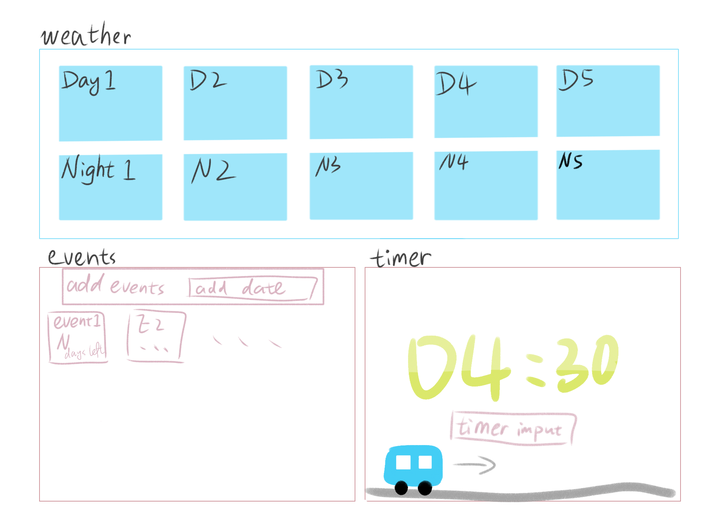
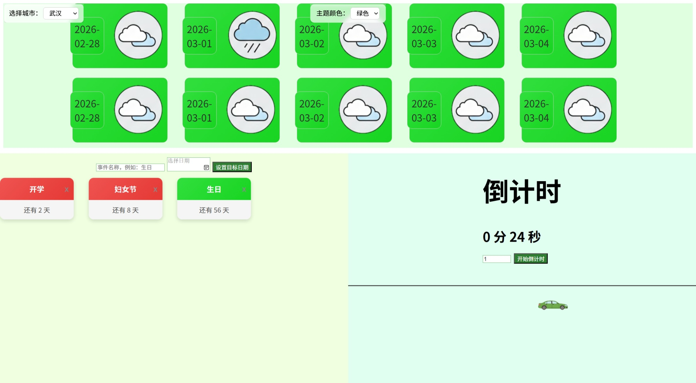
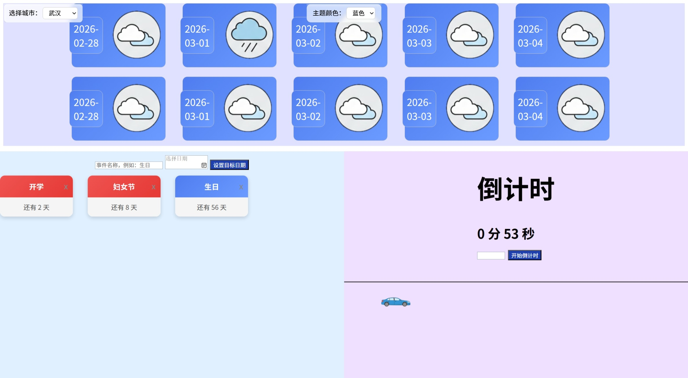
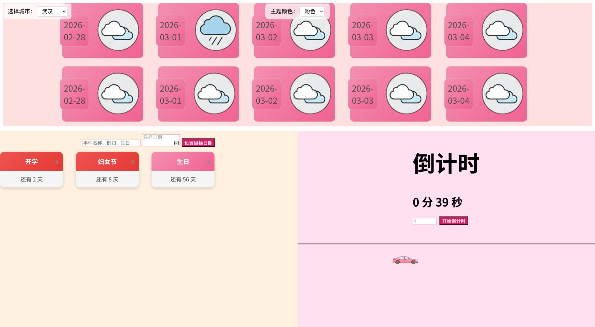

# Daily Notice Board 
Daily Notice Board is a lightweight Flask-based dashboard that displays countdowns for important events, a live timer, and a weather forecast. It is designed to be simple, expressive, and visually playful. The current version includes a static weather module (set to Wuhan), and future updates will introduce location selection and UI enhancements. 
--- 
## Features 
- Weather forecast module powered by **Open‑Meteo API**
- Add custom events with a target date 
- Automatic countdown calculation 
- Live countdown timer 
- Animated UI elements (including a moving car based on remaining time) 
- Event deletion 
- Responsive layout 
- Planned: theme color switching 
- Planned: weather location selector

## Initial Sketch 
The project began with a simple hand‑drawn UI sketch that defined the basic layout: a weather panel at the top, event countdown cards in the middle, and a playful animated car at the bottom. This sketch guided the structure of the final interface. 

## Screenshots

## Tech Stack 
- **Backend:** Python Flask 
- **Frontend:** HTML, CSS, JavaScript 
- **Weather Data:** Open‑Meteo (https://open-meteo.com/) 
- **Storage:** JSON file 
- **Animations:** CSS animations + JavaScript

